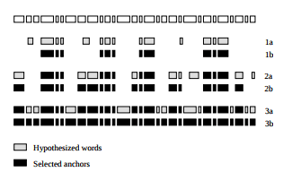

# sail-forensic-gentle

This repo is a wrapper on top of the forced alignment library Gentle. On particularly long and/or noise audio files, 
small errors have the potential to accumulate within the the Viterbi algorithm that is used by Gentle. In order to
resolve this issue, our aligner implements Moreno's algorithm on top of Gentle.

In the paper [“A Recursive Algorithm for the Forced Alignment of very Long Audio Segments,”](http://citeseerx.ist.psu.edu/viewdoc/download?doi=10.1.1.649.6346&rep=rep1&type=pdf) Moreno proposes a new 
recursive method of ensuring quality. Running a forced aligner down a long audio file creates a large possibility 
of misalignment due to small errors that accumulates over the course of the file.

In his paper, Moreno proposed the creation of these so-called “anchor points” in order to develop a isolate the 
segments of the audio that are correctly aligned. A stretch of audio is an anchor point if it contains N number of 
consecutive correctly aligned words.


<p align="center">
  
  <br>
  The larger the N, the more accurate the model will be. The smaller the N, the faster the model will be.
</p>


With these anchor points having been located, our wrapper will then run Gentle recursively on each individual non-anchored 
section of audio. This isolation of dis-aligned clips reduces the number of errors in the transcript or audio 
by requiring that Segments meet both Gentle's success criteria and Moreno's Anchor criteria, as well as increases
the number of total aligned words. 

# Installation Process

**Dependencies**

1. Python 2
2. Pydub - `pip install pydub`
3. Gentle - Instructions available @ https://github.com/lowerquality/gentle. 

Following installation of Gentle, you must also add Gentle to your permanent Python path, and you must add the `gentle` directory within the Gentle installation to the path:

**Linux/Mac**

Add the following 2 lines to your `.bashrc` file

```bash
export PYTHONPATH=/path/to/gentle/download:${PYTHONPATH}`
export PYTHONPATH=/path/to/gentle/downlaod/gentle:${PYTHONPATH}
```

**Update Changes**

  `source /.bashrc`

# Usage

```bash
python2 align.py audio.wav transcript.txt
```

Prints out each word in the transcript, whether each word is aligned or unaligned, the start time, and end time of each aligned word.

